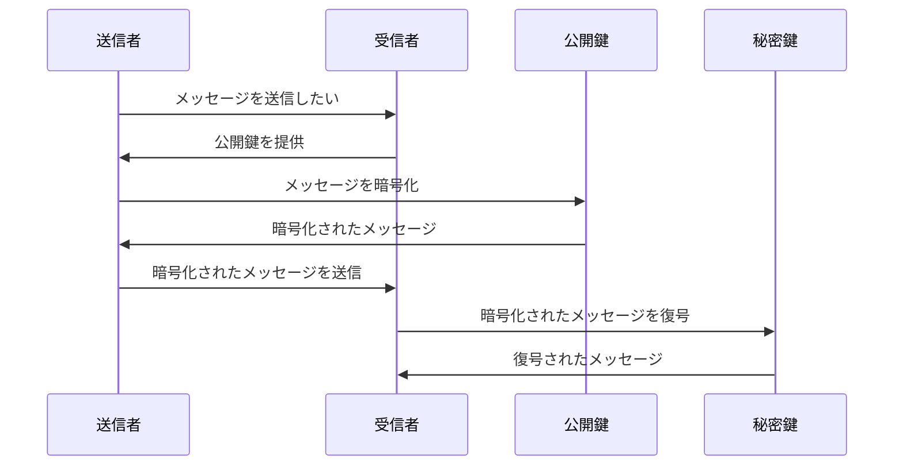

# 暗号処理

## それぞれの歴史

1. RSAの登場
- 年代: 1977年
- 発表者: Ron Rivest、Adi Shamir、Leonard Adleman
- 影響: 非対称暗号化の先駆けとされ、セキュアな通信やデータ保存に広く用いられています。
- 特徴: 公開鍵と秘密鍵のペアを使用。一方の鍵で暗号化すると、もう一方の鍵でしか復号できない。

2. PGP (Pretty Good Privacy)
- 年代: 1991年
- 発表者: Phil Zimmermann
- 影響: 電子メールの暗号化と署名に広く使用され、暗号技術を一般に普及させました。
- 特徴: RSA, DSAなど複数の暗号アルゴリズムを組み合わせて使用。

3. SSL/TLS
- 年代: SSLは1994年、TLSは1999年
- 発表者: Netscape（SSL）、IETF（TLS）
- 影響: インターネット上のセキュアな通信の標準となりました。
- 特徴: RSAやその他の暗号アルゴリズムを用いて、通信を暗号化。

4. ブロックチェーン
- 年代: 2008年（Bitcoinの登場とともに）
- 発表者: サトシ・ナカモト（仮名）
- 影響: 分散型台帳技術として、金融からサプライチェーンまで多くの分野で使用されています。
- 特徴: データの改ざんが困難で、透明性が高い。

5. NFT (Non-Fungible Token)
- 年代: 2017年頃から注目され始めました。
- 影響: デジタルアートやコレクティブ、ゲーム内アイテムなど、デジタル資産の所有権を証明する新しい方法として広まっています。
- 特徴: ブロックチェーン上に存在し、一意性と所有権が確保されています。

6. 2023年のNFTとブロックチェーン
- 影響: NFTはアート、音楽、ゲームなど多くのクリエイティブ産業で使用されています。ブロックチェーンは金融、医療、不動産など、さまざまな産業での応用が拡大しています。
- 特徴: より高度なスマートコントラクト、スケーラビリティの向上、エコフレンドリーなブロックチェーン技術（例：PoS）などが開発されています。


## SSHキーの種類と生成コマンド

| 鍵の種類 (`-t` オプション) | 推奨ビット長 (`-b` オプション) | 説明 |
|--------------------------|-------------------------------|------|
| RSA                      | 2048, 4096                    | 一般的に広く使用されている。鍵長が長くなる傾向があります。 |
| DSA                      | 1024 (固定)                   | 以前はよく使用されていましたが、セキュリティ上の問題から次第に使用が減っています。 |
| ECDSA                    | 256, 384, 521                 | 楕円曲線暗号を基にしたSSHキー。鍵長が短く、計算効率が良いです。 |
| Ed25519                  | N/A (固定)                    | より新しい種類のSSHキーで、高いセキュリティと効率性を兼ね備えています。 |

RSA: 一般的に広く使用されています。鍵長が長くなる傾向があります。

```bash
ssh-keygen -t rsa -b 4096
```

DSA: 以前はよく使用されていましたが、セキュリティ上の問題から次第に使用が減っています。

```bash
ssh-keygen -t dsa
```

ECDSA: 楕円曲線暗号を基にしたSSHキー。鍵長が短く、計算効率が良いです。

```bash
ssh-keygen -t ecdsa -b 521
```

Ed25519: より新しい種類のSSHキーで、高いセキュリティと効率性を兼ね備えています。

```bash
ssh-keygen -t ed25519
```

## SSHキーの生成されるファイル

例）SSHキーを使用した、メッセージを送受信する場合の流れ


- 公開鍵: 通常は `~/.ssh/id_<algorithm>.pub` という形式で保存されます。例えば、RSAの場合は `~/.ssh/id_rsa.pub`。
- 秘密鍵: 通常は `~/.ssh/id_<algorithm>` という形式で保存されます。例えば、RSAの場合は `~/.ssh/id_rsa`。

1. 保存方法: `ssh-keygen` コマンドを実行すると、キーの保存場所を聞かれます。デフォルトの場所に保存する場合は、そのままEnterキーを押します。

```bash
Enter file in which to save the key (/home/yourusername/.ssh/id_rsa):
```

2. 保存場所: 
- Linux/Mac: デフォルトでは `~/.ssh/` ディレクトリに保存されます。
- Windows: Git Bashを使用している場合、`C:\Users\<YourUsername>\.ssh\` に保存されます。WSLを使用している場合は、Linuxと同様に `~/.ssh/` に保存されます。

3. パーミッション: 秘密鍵のパーミッションは非常に重要です。不適切なパーミッションが設定されていると、SSH接続が拒否される場合があります。以下のコマンドでパーミッションを適切に設定できます。

```bash
chmod 600 ~/.ssh/id_<algorithm>
```

### 使い方

#### GitHubとのSSH通信

1. 公開鍵のアップロード: GitHubのアカウント設定にある「SSH and GPG keys」セクションで公開鍵（`.pub` ファイル）をアップロードします。

- [GitHubでのSSHキーの設定](https://docs.github.com/en/authentication/connecting-to-github-with-ssh)

接続テスト
```bash
$ ssh -T git@github.com
Enter passphrase for key '/Users/shuhei/.ssh/id_rsa': 
Hi shuhei-fujita! You've successfully authenticated, but GitHub does not provide shell access.
```

2. リモートリポジトリの設定: `git` コマンドでリモートリポジトリをSSH URLで設定します。

```bash
git remote add origin git@github.com:username/repository.git
```

#### サーバーとのSSH通信

1. 公開鍵のコピー: `ssh-copy-id` コマンドを使用して、公開鍵をサーバーにコピーします。

```bash
ssh-copy-id username@server_address
```

2. SSH接続: 以下のコマンドでSSH接続を行います。

```bash
ssh username@server_address
```

### 注意点

- パーミッション: 秘密鍵のパーミッションは非常に重要です。不適切なパーミッションが設定されていると、SSH接続が拒否される場合があります。

```bash
chmod 600 ~/.ssh/id_<algorithm>
```

- 秘密鍵の保管: 秘密鍵は極めて重要な情報ですので、安全な場所に保管してください。また、バックアップも推奨されます。

以上がSSHキーの生成と保存に関する基本的な情報です。特定の用途や環境に応じて、保存場所やパーミッションを調整することがあります。
